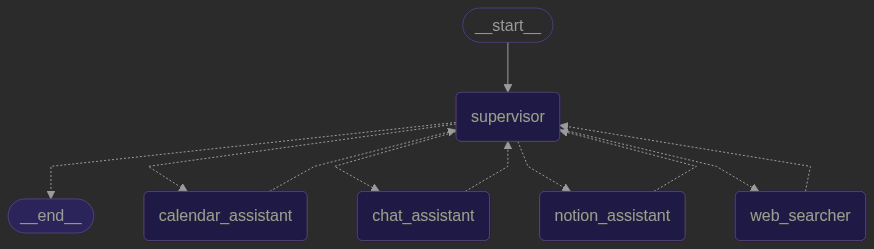
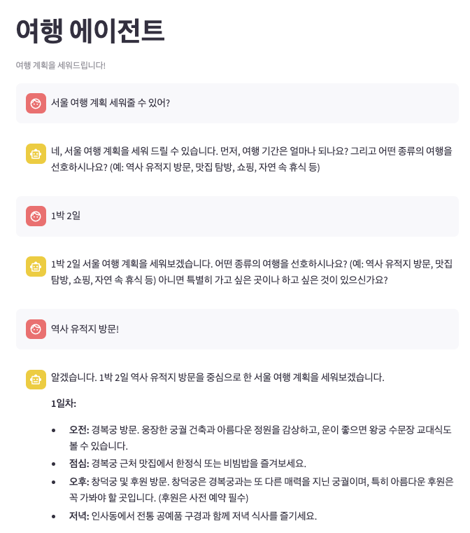
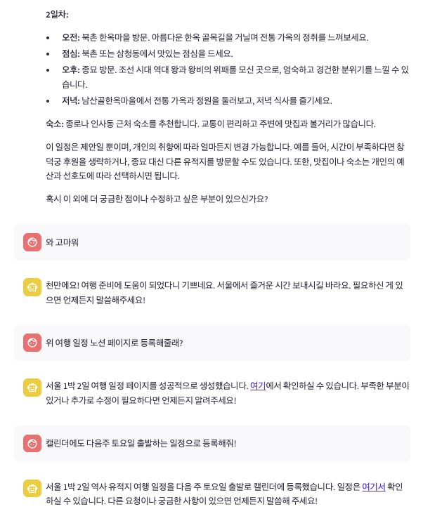

# 프로젝트 개요
이 프로젝트는 LangGraph를 기반으로 한 여행 계획 에이전트입니다. 사용자가 여행 목적지, 기간 등의 정보를 입력하면 에이전트는 다음과 같은 작업을 수행합니다:
- 웹 검색: 구글 검색을 활용하여 여행 정보를 검색하여 여행 계획을 세웁니다.
- 일정 관리: 구글 캘린더에 일정을 등록합니다.
- 노션 연동: 여행 계획을 노션 페이지로 생성합니다.
- 대화형 인터페이스: 사용자와의 대화를 통해 여행 계획을 수립합니다.

# 실행을 위한 준비 작업
에이전트를 실행 해보기 위해서 몇가지 사전 준비 작업이 필요합니다.

#### OpenAI API Key 발급
1. [OpenAI 플랫폼](https://platform.openai.com/) 접속
2. 계정이 있으면 로그인, 없다면 회원가입
3. API Keys 메뉴로 이동
4. Create new secret key로 API Key 생성 및 복사
5. .env 파일의 OPENAI_API_KEY 값으로 할당합니다.

#### Google API Key 발급
1. [구글 클라우드 콘솔](https://console.cloud.google.com/) 접속
2. 프로젝트가 없으면 생성합니다.
2. API 및 서비스 -> 사용자 인증 정보로 이동
3. 사용자 인증 정보 만들기 클릭 -> API 키 선택
4. API 키 복사
5. .env 파일의 GOOGLE_API_KEY 값으로 할당합니다.

#### Google Search 사용 방법
1. 위에서 발급 받은 API Key가 필요합니다.
2. [프로그래밍 검색 엔진](https://programmablesearchengine.google.com/controlpanel/all) 접속하여 추가 버튼을 클릭합니다.
3. 검색 엔진을 생성하고 마지막에 보여지는 검색엔진 ID를 복사합니다.
4. .env 파일의 GOOGLE_CSE_ID 값으로 할당합니다.
5. [구글 클라우드 콘솔](https://console.cloud.google.com/) 접속
6. API 및 서비스 -> 사용 설정된 API 및 서비스로 이동하여 API 및 서비스 사용 설정 클릭
7. Custom Search API 검색하여 활성화합니다.

#### 노션 API Key 발급 및 Parent Page Id
1. [노션 API 통합 페이지](https://www.notion.so/profile/integrations)에 접속합니다.
2. 새 API 통합을 눌러 API Key를 발급받아 복사합니다.
3. .env 파일의 NOTION_API_KEY 값으로 할당합니다.
4. 노션 페이지 생성을 위해서 Parent Page Id가 필요합니다. 여행 일정을 저장할 페이지를 생성한 후 '...'을 클릭하여 링크 복사를 합니다.
5. http://www.notion.so/{page_id}?abc=def 와 같은 형태로 되어 있어 {page_id}에 해당하는 부분을 복사합니다. 
6. .env 파일의 NOTION_PARENT_PAGE_ID 값으로 할당합니다.

#### Google Calendar 사용을 위한 설정
1. 먼저 [구글 클라우드 콘솔](https://console.cloud.google.com/)에 접속합니다.
2. API 및 서비스 -> 사용 설정된 API 및 서비스로 이동하여 API 및 서비스 사용 설정 클릭
3. Google Calendar API 검색하여 활성화합니다.
4. API 및 서비스 메뉴로 돌아와 OAuth 동의 화면 -> 클라이언트로 이동합니다.
5. 클라이언트 만들기를 눌러 데스크톱 앱으로 생성하면 마지막에 'OAuth 클라이언트 생성됨'이라는 창이 뜨면서 json을 다운로드 할 수 있습니다. 다운로드 받습니다.
6. 다운로드 받은 파일의 이름을 credentials.json으로 저장하여 프로젝트에 복사합니다.
7. API 및 서비스 메뉴로 돌아와 OAuth 동의 화면 -> 대상으로 이동합니다.
8. 테스트 사용자에 현재 구글 계정을 추가합니다.
9. 처음 실행할 때 캘린더 액세스에 대한 권한 요청을 허용해주는 창이 뜨게 되고, 허용해주면 Google Calendar API를 사용할 수 있게 됩니다.

# 에이전트 그래프 구조

# 실행 방법
1. clone repository:
> git clone https://github.com/agent-yj/travel-agent.git  
> cd travel-agent

2. env.example 파일을 .env로 복사하고, 필요한 API 키를 설정합니다:  
> cp .env.example .env 

3. 필요한 Python 패키지를 설치합니다:
> python3.11 -m venv venv  
> source ./venv/bin/activate  
> pip install -r requirements.txt

4. Streamlit 애플리케이션을 실행합니다:
> streamlit run main.py

5. 브라우저에서 http://localhost:8501에 접속하여 대화를 시작합니다.

# 실행 결과

